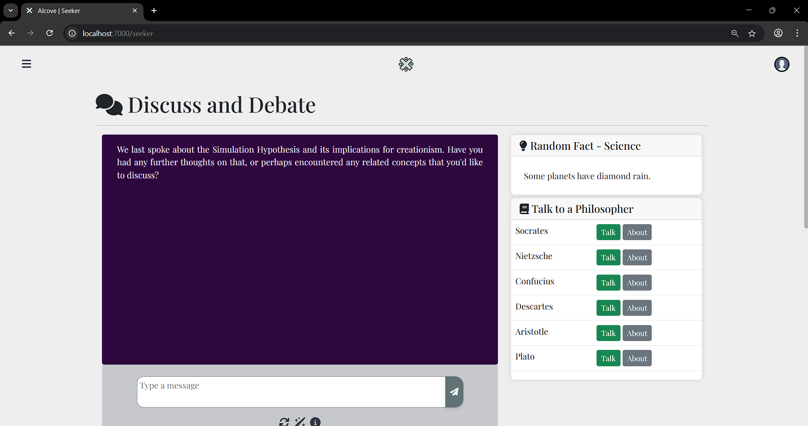

# Alcove

Alcove is a light-weight AI guided companion website that serves various purposes and allows for a multifaceted and personalized experience. It has a collection of chatbots, interfaces and various tools that can be used for info-tainment and productivity, also including brief exercises and mindfulness activities - an intellectual suite in itself.

## Gallery - Platform Highlights

### Home Page

A landing page for the website, provides quick access to tools.

### Chatbot - Dynamo (Talk about anything & everything)

A multi-purpose chat assistant. Best suited for discussions and casual conversation.

### Chatbot - Dynamo (One bot, multiple personas!)

Dynamo can be adapted to work with custom personas - as you like!

### Tools for Mindfulness

* Journaling
* Guided Meditation
* Radar - an AI powered in-conversation mental health screening tool 

### Chatbot - Shaman (A personalized therapist)

A therapist that's always all-ears and free of judgement. Offers advice as you converse.

### Chatbot - Seeker (Learn, Discuss & Debate)

A bot suited for in-depth discussions on any thing that intrigues you.

### Chatbot Widgets - Briefings (Condense a Wikipedia Article for QnA)

A widget that allows you to extract summaries from Wikipedia articles and engage in QnA.

### Chatbot - Ace (Personal Assistant)

A personal assistant that's good at anything you ask it do for you!

### Chatbot Widgets - Quick Access (Rapid QnA + Pomodoros)

A quick widget for co-operative pomodoro based work that allows you to access AI as you work in timed sessions to boost productivity.

### Projects - Collaborate with AI 

A comprehensive platform that allows you to create projects and collaborate with AI - be it technical, personal or academic.

... and many more such tools